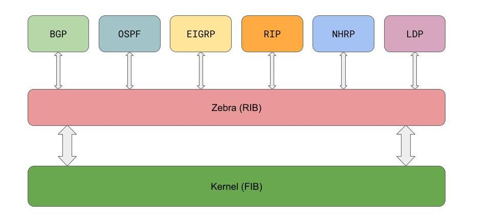

# FRR: The Most Popular Network Router You’ve Never Heard Of

**Copied from https://www.nextplatform.com/2020/10/26/frr-the-most-popular-network-router-youve-never-heard-of/**

Everyone in the networking industry seems to fall into one of two  camps: those that have used server-based routing software and those that have no idea such a thing exists. Now a solution called Free Range  Routing (FRR) is taking over cloud and enterprise datacenters around the world and if you are in the latter camp, you’ve probably never heard of it.

FRR traces its roots back to Quagga (and Zebra even before that) that developed into a software routing suite which has been part of the  open-source community for nearly 20 years. The Quagga software suite  offered BGP, OSPF and RIP support for Linux and Unix servers. This  allowed the development of things like BGP route servers or server-based VPN concentrators. Quagga was seen as an amazing tool in the network  engineering toolbox by network engineers that understood the value of a  software-based router over traditional appliances from the major  networking vendors. Quagga made slow and steady progress with a small  but dedicated community of developers.

The FRR routing software stack. Each protocol talks to the shared Routing  Information Base called Zebra and Zebra installs the routes directly  into the Linux kernel.

In 2010 when Cumulus Networks was founded, the Quagga routing suite  was used as a core component of their datacenter networking software,  Cumulus Linux (now part of Nvidia Networking). Cumulus Linux offers both BGP and OSPF routing services to their customers on their disaggregated datacenter switches. Cumulus invested significant resources into the  Quagga project in the form of bug fixes, quality assurance, and feature  improvements. Every customer-issued fix became a patch delivered back to the Quagga upstream community.

With Cumulus leading the charge, the community of commercial  developers began to grow, adding VMware, Orange Telecom, 6Wind, and  more. The rate of contributions and new features over the next few years grew beyond what the framework of the Quagga project could provide. A  team of developers, led by Cumulus Networks, and including those just  named, forked the Quagga project into Free Range Routing (FRR) in 2016  and put it under the governance of The Linux Foundation, ensuring that  the project stays strong, open, and fair.

With FRR’s momentum and new home it became more and more popular not  just as a routing stack to run on servers, but as a core component to  Ethernet switches and other network-based solutions. Running FRR on  servers or switches provides SDN, overlay networks, vendor  branded-firewall capabilities, and more. The broad application and use  case, combined with growing commercial support, has allowed the FRR  project to see more than 14,309 commits from more than 400 committers.  The power and stability of FRR led Microsoft to include it as part of  its open network operating system, SONiC, as well as for Amazon to use  in their open source [DENT](https://www.linuxfoundation.org/press-release/2019/12/dent-launches-to-simplify-enterprise-edge-networking-software/) networking software.

### The Value Of Routing Software

Being a free, open source application, FRR allows users to easily  acquire and use the software. Users start small with simple VM-based  labs or with a test software router in their environment. These  different use cases show some of the value of a software-only routing  application. Different use cases open up, and more deployments become  cost effective, when router features and innovation are no longer  available only in a hardware router appliance that forces customers to  deploy a proprietary hardware-software stack.

There are numerous production deployments using FRR as a software  router, including using x86-based internet facing routers, BGP route  reflectors, BGP route servers, and even normal endpoint-hosts running  routing protocols – often called routing on the host and completely  eliminating the need for VLANs, multi-chassis link aggregation (MLAG),  or any Layer 2 in the datacenter. FRR routing on the host can also take  advantage of SmartNICs like the Nvidia ConnectX, or run on Data  Processing Units (DPUs) such as the Nvidia BlueField. This  implementation offloads packet processing to adapter silicon, providing  host networking that is software-defined and hardware-accelerated.

When using something like routing on the host, unexpected advantages  open up, including the ability to move a server anywhere in the  datacenter and keep its IP address. Instead of the IP being tied to the  top-of-rack switch’s subnet, the IP is now advertised by the routing  protocol wherever that server lives or goes.

For users with simple Internet-facing needs, modern CPUs can easily  pass 10 Gb/sec or even 25 Gb/sec of traffic with ease. When combined  with routing software like FRR, you can now create an Internet router at a fraction of the cost of a traditional edge router. Since that server  is just a Linux server, you can add other applications and services like firewalls, load balancers, or even SD-WAN like applications or scripts  without the restrictions of classic routers. Use cases that require  terabits per second of switching throughput can run FRR on  high-performance Ethernet switch hardware like the Nvidia Spectrum  family. These switches run FRR and program dedicated ASICs that deliver  non-blocking high throughput and super low latency.

For example, customers could choose to run Nvidia Cumulus Linux on  their top-of-rack (ToR) switches and SONiC or DENT on their network  spine switches, plus run FRR on individual hosts. In this case, three  levels of the datacenter are all running FRR for routing and their  networking can be managed in the same way.

### The Future Of FRR

With such a strong and growing community, the future of FRR is  bright. A number of advanced features are on the roadmap including  expanding its existing segment routing support, an implementation of  Cisco Systems’ EIGRP routing protocol, full YANG-based data models, BGP  RPKI support, and more. Now that the AT&T DANOS project also uses  FRR as its routing stack, there is significant investment in enhancing  service provider features beyond the existing FRR focus on datacenter  networking.

Beyond the growing feature roadmap, FRR is also starting to act as the location to fulfill the original IETF motto of “[rough consensus and running code](https://tools.ietf.org/html/rfc7282).” New protocols being proposed through IETF are leveraging the open  nature of FRR to create running implementations of the protocol  proposals. FRR is a natural, vendor-neutral place to develop  implementations of new standards, while giving anyone access to the code to review and contribute. The addition of [OpenFabric](http://docs.frrouting.org/en/latest/fabricd.html) to FRR, a working implementation of the [OpenFabric IETF draft](https://tools.ietf.org/html/draft-white-openfabric), is a great example.

Expect to see more FRR in a variety of networking technologies you  interact with in the future from firewall appliances to software  routers, network operating systems or even server applications that run  FRR on the CPU or on a DPU. Although you may have never heard of FRR,  you are likely interacting with it and using it to connect to the cloud  almost every day.

### Get Involved

Free Range Routing is a fully open project, and always looking for  contributors for documentation, software or the discussion. You can  submit documentation updates via [Github](https://github.com/FRRouting/frr/tree/master/doc/user), join their [mailing list](https://lists.frrouting.org/listinfo/frog) or join the community [Slack channel](https://frrouting.slack.com/join/shared_invite/enQtNjM1MTkzMDQ0Mzg2LTAxZmQ5ODk0NTE1NjZmOWNkNmJkODc3YWZhOWE3NjQ1MzI2YWMzZmViNzVmYjBhYWNkNDYwMjVkOWMzMWZkYWM#/).

If you want an easy way to try out FRR yourself, Nvidia provides a  free, cloud-hosted lab of their Nvidia Cumulus Linux software running  FRR. You can use [Nvidia Cumulus in the Cloud](http://cumulusnetworks.com/citc) today or get a guided tour including using FRR with the [Nvidia Cumulus Linux On Demand](https://cumulusnetworks.com/lp/cumulus-linux-on-demand/) labs.