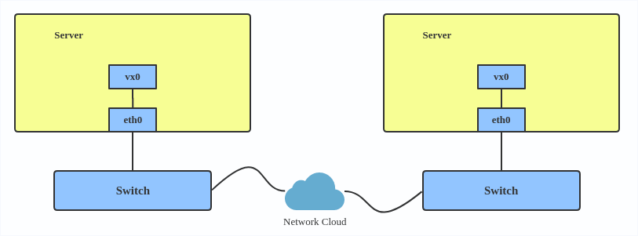
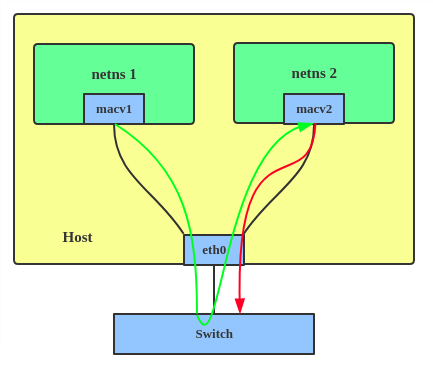
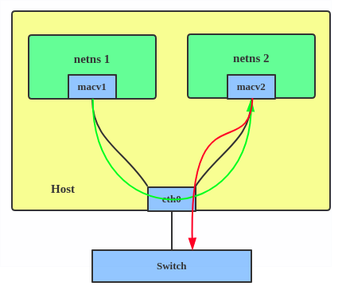
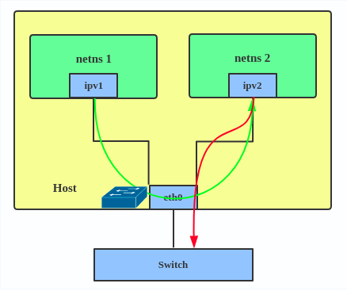
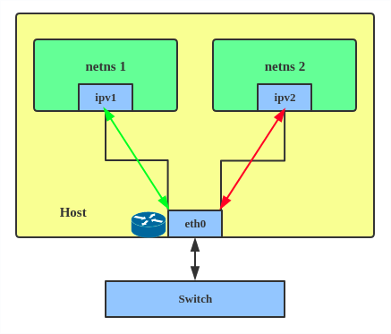
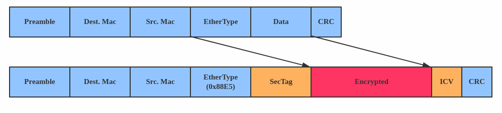

# Introduction to Linux interfaces for virtual networking


**Copied from https://developers.redhat.com/blog/2018/10/22/introduction-to-linux-interfaces-for-virtual-networking/**

[Linux](https://developers.redhat.com/topics/linux/) has rich virtual networking capabilities that are used as basis for hosting VMs and [containers](https://developers.redhat.com/blog/category/containers/), as well as cloud environments. In this post, I will give a brief  introduction to all commonly used virtual network interface types. There is no code analysis, only a brief introduction to the interfaces and  their usage on Linux. Anyone with a network background might be  interested in this blog post. A list of interfaces can be obtained using the command `ip link help`.

This post covers the following frequently used interfaces and some interfaces that can be easily confused with one another:

- [Bridge](https://developers.redhat.com/blog/2018/10/22/introduction-to-linux-interfaces-for-virtual-networking/#bridge)
- [Bonded interface](https://developers.redhat.com/blog/2018/10/22/introduction-to-linux-interfaces-for-virtual-networking/#bonded)
- [Team device](https://developers.redhat.com/blog/2018/10/22/introduction-to-linux-interfaces-for-virtual-networking/#team)
- [VLAN (Virtual LAN)](https://developers.redhat.com/blog/2018/10/22/introduction-to-linux-interfaces-for-virtual-networking/#vlan)[ ](https://developers.redhat.com/blog/2018/10/22/introduction-to-linux-interfaces-for-virtual-networking/#vxlan)
- [VXLAN (Virtual eXtensible Local Area Network)](https://developers.redhat.com/blog/2018/10/22/introduction-to-linux-interfaces-for-virtual-networking/#vxlan)
- [MACVLAN](https://developers.redhat.com/blog/2018/10/22/introduction-to-linux-interfaces-for-virtual-networking/#macvlan)
- [IPVLAN](https://developers.redhat.com/blog/2018/10/22/introduction-to-linux-interfaces-for-virtual-networking/#ipvlan)
- [MACVTAP/IPVTAP](https://developers.redhat.com/blog/2018/10/22/introduction-to-linux-interfaces-for-virtual-networking/#macvtap)
- [MACsec (Media Access Control Security)](https://developers.redhat.com/blog/2018/10/22/introduction-to-linux-interfaces-for-virtual-networking/#macsec)
- [VETH (Virtual Ethernet)](https://developers.redhat.com/blog/2018/10/22/introduction-to-linux-interfaces-for-virtual-networking/#veth)
- [VCAN (Virtual CAN)](https://developers.redhat.com/blog/2018/10/22/introduction-to-linux-interfaces-for-virtual-networking/#vcan)
- [VXCAN (Virtual CAN tunnel)](https://developers.redhat.com/blog/2018/10/22/introduction-to-linux-interfaces-for-virtual-networking/#vxcan)
- [IPOIB (IP-over-InfiniBand)](https://developers.redhat.com/blog/2018/10/22/introduction-to-linux-interfaces-for-virtual-networking/#ipoib)
- [NLMON (NetLink MONitor)](https://developers.redhat.com/blog/2018/10/22/introduction-to-linux-interfaces-for-virtual-networking/#nlmon)
- [Dummy interface](https://developers.redhat.com/blog/2018/10/22/introduction-to-linux-interfaces-for-virtual-networking/#dummy)
- [IFB (Intermediate Functional Block)](https://developers.redhat.com/blog/2018/10/22/introduction-to-linux-interfaces-for-virtual-networking/#ifb)
- [netdevsim](https://developers.redhat.com/blog/2018/10/22/introduction-to-linux-interfaces-for-virtual-networking/#netdevsim)

After reading this article, you will know  what these interfaces are, what’s the difference between them, when to  use them, and how to create them.
 For other interfaces like tunnel, please see [An introduction to Linux virtual interfaces: Tunnels](https://developers.redhat.com/blog/2019/05/17/an-introduction-to-linux-virtual-interfaces-tunnels/)


## Bridge

A Linux bridge behaves like a network  switch. It forwards packets between interfaces that are connected to it. It’s usually used for forwarding packets on routers, on gateways, or  between VMs and network namespaces on a host. It also supports STP, VLAN filter, and multicast snooping.

[](https://developers.redhat.com/blog/wp-content/uploads/2018/10/bridge.png)

Use a bridge when you want to establish communication channels between VMs, containers, and your hosts.

Here’s how to create a bridge:

```
# ip link add br0 type bridge
# ip link set eth0 master br0
# ip link set tap1 master br0
# ip link set tap2 master br0
# ip link set veth1 master br0
```

This creates a bridge device named `br0` and sets two TAP devices (`tap1`, `tap2`), a VETH device (`veth1`), and a physical device (`eth0`) as its slaves, as shown in the diagram above.

## Bonded interface

The Linux bonding driver provides a method for aggregating multiple network interfaces into a single logical  “bonded” interface. The behavior of the bonded interface depends on the  mode; generally speaking, modes provide either hot standby or load  balancing services.

[](https://developers.redhat.com/blog/wp-content/uploads/2018/10/bond.png)

Use a bonded interface when you want to increase your link speed or do a failover on your server.

Here’s how to create a bonded interface:

```
ip link add bond1 type bond miimon 100 mode active-backup
ip link set eth0 master bond1
ip link set eth1 master bond1
```

This creates a bonded interface named `bond1` with mode active-backup. For other modes, please see the [kernel documentation](https://www.kernel.org/doc/Documentation/networking/bonding.txt).

## Team device

Similar a bonded interface, the purpose of a team device is to provide a mechanism to group multiple NICs (ports)  into one logical one (teamdev) at the L2 layer.

[](https://developers.redhat.com/blog/wp-content/uploads/2018/10/team.png)

The main thing to realize is that a team  device is not trying to replicate or mimic a bonded interface. What it  does is to solve the same problem using a different approach, using, for example, a lockless (RCU) TX/RX path and modular design.

But there are also some functional  differences between a bonded interface and a team. For example, a team  supports LACP load-balancing, NS/NA (IPV6) link monitoring, D-Bus  interface, etc., which are absent in bonding. For further details about  the differences between bonding and team, see [Bonding vs. Team features](https://github.com/jpirko/libteam/wiki/Bonding-vs.-Team-features).

Use a team when you want to use some features that bonding doesn’t provide.

Here’s how to create a team:

```
# teamd -o -n -U -d -t team0 -c '{"runner": {"name": "activebackup"},"link_watch": {"name": "ethtool"}}'
# ip link set eth0 down
# ip link set eth1 down
# teamdctl team0 port add eth0
# teamdctl team0 port add eth1
```

This creates a team interface named `team0` with mode `active-backup`, and it adds `eth0` and `eth1` as `team0`‘s sub-interfaces.

A new driver called [net_failover](https://www.kernel.org/doc/html/latest/networking/net_failover.html) has been added to Linux recently. It’s another failover master net device for virtualization and manages a primary ([passthru/VF [Virtual Function\]](https://wiki.libvirt.org/page/Networking#PCI_Passthrough_of_host_network_devices) device) slave net device and a standby (the original paravirtual interface) slave net device.

[](https://developers.redhat.com/blog/wp-content/uploads/2018/10/net_failover.png)

## VLAN

A VLAN, aka virtual LAN, separates  broadcast domains by adding tags to network packets. VLANs allow network administrators to group hosts under the same switch or between  different switches.

The VLAN header looks like:

[](https://developers.redhat.com/blog/wp-content/uploads/2018/10/vlan_01.png)

Use a VLAN when you want to separate subnet in VMs, namespaces, or hosts.

Here’s how to create a VLAN:

```
# ip link add link eth0 name eth0.2 type vlan id 2
# ip link add link eth0 name eth0.3 type vlan id 3
```

This adds VLAN 2 with name `eth0.2` and VLAN 3 with name `eth0.3`. The topology looks like this:

[](https://developers.redhat.com/blog/wp-content/uploads/2018/10/vlan.png)

***Note\***: When  configuring a VLAN, you need to make sure the switch connected to the  host is able to handle VLAN tags, for example, by setting the switch  port to trunk mode.

## VXLAN

VXLAN (Virtual eXtensible Local Area  Network) is a tunneling protocol designed to solve the problem of  limited VLAN IDs (4,096) in IEEE 802.1q. It is described by [IETF RFC 7348](https://tools.ietf.org/html/rfc7348).

With a 24-bit segment ID, aka VXLAN  Network Identifier (VNI), VXLAN allows up to 2^24 (16,777,216) virtual  LANs, which is 4,096 times the VLAN capacity.

VXLAN encapsulates Layer 2 frames with a VXLAN header into a UDP-IP packet, which looks like this:

[](https://developers.redhat.com/blog/wp-content/uploads/2018/10/vxlan_01.png)

VXLAN is typically deployed in data centers on virtualized hosts, which may be spread across multiple racks.

[](https://developers.redhat.com/blog/wp-content/uploads/2018/10/vxlan.png)

Here’s how to use VXLAN:

```
# ip link add vx0 type vxlan id 100 local 1.1.1.1 remote 2.2.2.2 dev eth0 dstport 4789
```

For reference, you can read the [VXLAN kernel documentation](https://www.kernel.org/doc/Documentation/networking/vxlan.txt) or [this VXLAN introduction](https://vincent.bernat.ch/en/blog/2017-vxlan-linux).

## MACVLAN

With VLAN, you can create multiple  interfaces on top of a single one and filter packages based on a VLAN  tag. With MACVLAN, you can create multiple interfaces with different  Layer 2 (that is, Ethernet MAC) addresses on top of a single one.

Before MACVLAN, if you wanted to connect  to physical network from a VM or namespace, you would have needed to  create TAP/VETH devices and attach one side to a bridge and attach a  physical interface to the bridge on the host at the same time, as shown  below.

[](https://developers.redhat.com/blog/wp-content/uploads/2018/10/br_ns.png)

Now, with MACVLAN, you can bind a physical interface that is associated with a MACVLAN directly to namespaces,  without the need for a bridge.

[](https://developers.redhat.com/blog/wp-content/uploads/2018/10/macvlan.png)

There are five MACVLAN types:

\1. Private: doesn’t allow communication  between MACVLAN instances on the same physical interface, even if the  external switch supports hairpin mode.

[](https://developers.redhat.com/blog/wp-content/uploads/2018/10/macvlan_01.png)

\2. VEPA: data from one MACVLAN instance to the other on the same physical interface is transmitted over the  physical interface. Either the attached switch needs to support hairpin  mode or there must be a TCP/IP router forwarding the packets in order to allow communication.

[](https://developers.redhat.com/blog/wp-content/uploads/2018/10/macvlan_02.png)

\3. Bridge: all endpoints are directly connected to each other with a simple bridge via the physical interface.

[](https://developers.redhat.com/blog/wp-content/uploads/2018/10/macvlan_03.png)

\4. Passthru: allows a single VM to be connected directly to the physical interface.

[](https://developers.redhat.com/blog/wp-content/uploads/2018/10/macvlan_04.png)

\5. Source: the source mode is used to  filter traffic based on a list of allowed source MAC addresses to create MAC-based VLAN associations. Please see the [commit message](https://git.kernel.org/pub/scm/linux/kernel/git/davem/net.git/commit/?id=79cf79abce71).

The type is chosen according to different needs. Bridge mode is the most commonly used.

Use a MACVLAN when you want to connect directly to a physical network from containers.

Here’s how to set up a MACVLAN:

```
# ip link add macvlan1 link eth0 type macvlan mode bridge
# ip link add macvlan2 link eth0 type macvlan mode bridge
# ip netns add net1
# ip netns add net2
# ip link set macvlan1 netns net1
# ip link set macvlan2 netns net2
```

This creates two new MACVLAN devices in bridge mode and assigns these two devices to two different namespaces.

## IPVLAN

IPVLAN is similar to MACVLAN with the difference being that the endpoints have the same MAC address.

[](https://developers.redhat.com/blog/wp-content/uploads/2018/10/ipvlan.png)

IPVLAN supports L2 and L3 mode. IPVLAN L2  mode acts like a MACVLAN in bridge mode. The parent interface looks like a bridge or switch.

[](https://developers.redhat.com/blog/wp-content/uploads/2018/10/ipvlan_01.png)

In IPVLAN L3 mode, the parent interface  acts like a router and packets are routed between endpoints, which gives better scalability.

[](https://developers.redhat.com/blog/wp-content/uploads/2018/10/ipvlan_02.png)

Regarding when to use an IPVLAN, the [IPVLAN kernel documentation](https://www.kernel.org/doc/Documentation/networking/ipvlan.txt) says that MACVLAN and IPVLAN “are very similar in many regards and the  specific use case could very well define which device to choose. if one  of the following situations defines your use case then you can choose to use ipvlan –
 (a) The Linux host that is connected to the external switch / router has policy configured that allows only one mac per port.
 (b) No of virtual devices created on a master exceed the mac capacity  and puts the NIC in promiscuous mode and degraded performance is a  concern.
 (c) If the slave device is to be put into the hostile / untrusted  network namespace where L2 on the slave could be changed / misused.”

Here’s how to set up an IPVLAN instance:

```
# ip netns add ns0
# ip link add name ipvl0 link eth0 type ipvlan mode l2
# ip link set dev ipvl0 netns ns0
```

This creates an IPVLAN device named `ipvl0` with mode L2, assigned to namespace `ns0`.

## MACVTAP/IPVTAP

MACVTAP/IPVTAP is a new device driver  meant to simplify virtualized bridged networking. When a MACVTAP/IPVTAP  instance is created on top of a physical interface, the kernel also  creates a character device/dev/tapX to be used just like a [TUN/TAP](https://en.wikipedia.org/wiki/TUN/TAP) device, which can be directly used by KVM/QEMU.

With MACVTAP/IPVTAP, you can replace the combination of TUN/TAP and bridge drivers with a single module:

[](https://developers.redhat.com/blog/wp-content/uploads/2018/10/macvtap.png)

Typically, MACVLAN/IPVLAN is used to make  both the guest and the host show up directly on the switch to which the  host is connected. The difference between MACVTAP and IPVTAP is same as  with MACVLAN/IPVLAN.

Here’s how to create a MACVTAP instance:

```
# ip link add link eth0 name macvtap0 type macvtap
```

## MACsec

MACsec (Media Access Control Security) is  an IEEE standard for security in wired Ethernet LANs. Similar to IPsec,  as a layer 2 specification, MACsec can protect not only IP traffic but  also ARP, neighbor discovery, and DHCP. The MACsec headers look like  this:

[](https://developers.redhat.com/blog/wp-content/uploads/2018/10/macsec_01.png)

The main use case for MACsec is to secure all messages on a standard LAN including ARP, NS, and DHCP messages.

[](https://developers.redhat.com/blog/wp-content/uploads/2018/10/macsec.png)

Here’s how to set up a MACsec configuration:

```
# ip link add macsec0 link eth1 type macsec
```

***Note\***: This only adds a MACsec device called `macsec0` on interface `eth1`. For more detailed configurations, please see the “Configuration example” section in this [MACsec introduction by Sabrina Dubroca](https://developers.redhat.com/blog/2016/10/14/macsec-a-different-solution-to-encrypt-network-traffic/).

## VETH

The VETH (virtual Ethernet) device is a local Ethernet tunnel. Devices are created in pairs, as shown in the diagram below.

Packets transmitted on one device in the  pair are immediately received on the other device. When either device is down, the link state of the pair is down.

[](https://developers.redhat.com/blog/wp-content/uploads/2018/10/veth.png)

Use a VETH configuration when namespaces need to communicate to the main host namespace or between each other.

Here’s how to set up a VETH configuration:

```
# ip netns add net1
# ip netns add net2
# ip link add veth1 netns net1 type veth peer name veth2 netns net2
```

This creates two namespaces, `net1` and `net2`, and a pair of VETH devices, and it assigns `veth1` to namespace `net1` and `veth2` to namespace `net2`. These two namespaces are connected with this VETH pair. Assign a pair  of IP addresses, and you can ping and communicate between the two  namespaces.

## VCAN

Similar to the network loopback devices,  the VCAN (virtual CAN) driver offers a virtual local CAN (Controller  Area Network) interface, so users can send/receive CAN messages via a  VCAN interface. CAN is mostly used in the automotive field nowadays.

For more CAN protocol information, please refer to the [kernel CAN documentation](https://www.kernel.org/doc/Documentation/networking/can.txt).

Use a VCAN when you want to test a CAN protocol implementation on the local host.

Here’s how to create a VCAN:

```
# ip link add dev vcan1 type vcan
```

## VXCAN

Similar to the VETH driver, a VXCAN  (Virtual CAN tunnel) implements a local CAN traffic tunnel between two  VCAN network devices. When you create a VXCAN instance, two VXCAN  devices are created as a pair. When one end receives the packet, the  packet appears on the device’s pair and vice versa. VXCAN can be used  for cross-namespace communication.

Use a VXCAN configuration when you want to send CAN message across namespaces.

Here’s how to set up a VXCAN instance:

```
# ip netns add net1
# ip netns add net2
# ip link add vxcan1 netns net1 type vxcan peer name vxcan2 netns net2
```

***Note\***: VXCAN is not yet supported in Red Hat Enterprise Linux.

## IPOIB

An IPOIB device supports the  IP-over-InfiniBand protocol. This transports IP packets over InfiniBand  (IB) so you can use your IB device as a fast NIC.

The IPoIB driver supports two modes of  operation: datagram and connected. In datagram mode, the IB UD  (Unreliable Datagram) transport is used. In connected mode, the IB RC  (Reliable Connected) transport is used. The connected mode takes  advantage of the connected nature of the IB transport and allows an MTU  up to the maximal IP packet size of 64K.

For more details, please see the [IPOIB kernel documentation](https://www.kernel.org/doc/Documentation/infiniband/ipoib.txt).

Use an IPOIB device when you have an IB device and want to communicate with a remote host via IP.

Here’s how to create an IPOIB device:

```
# ip link add ib0 name ipoib0 type ipoib pkey IB_PKEY mode connected
```

## NLMON

NLMON is a Netlink monitor device.

Use an NLMON device when you want to monitor system Netlink messages.

Here’s how to create an NLMON device:

```
# ip link add nlmon0 type nlmon
# ip link set nlmon0 up
# tcpdump -i nlmon0 -w nlmsg.pcap
```

This creates an NLMON device named `nlmon0` and sets it up. Use a packet sniffer (for example, `tcpdump`) to capture Netlink messages. Recent versions of Wireshark feature decoding of Netlink messages.

## Dummy interface

A dummy interface is entirely virtual  like, for example, the loopback interface. The purpose of a dummy  interface is to provide a device to route packets through without  actually transmitting them.

Use a dummy interface to make an inactive  SLIP (Serial Line Internet Protocol) address look like a real address  for local programs. Nowadays, a dummy interface is mostly used for  testing and debugging.

Here’s how to create a dummy interface:

```
# ip link add dummy1 type dummy
# ip addr add 1.1.1.1/24 dev dummy1
# ip link set dummy1 up
```

## IFB

The IFB (Intermediate Functional Block)  driver supplies a device that allows the concentration of traffic from  several sources and the shaping incoming traffic instead of dropping it.

Use an IFB interface when you want to queue and shape incoming traffic.

Here’s how to create an IFB interface:

```
# ip link add ifb0 type ifb
# ip link set ifb0 up
# tc qdisc add dev ifb0 root sfq
# tc qdisc add dev eth0 handle ffff: ingress
# tc filter add dev eth0 parent ffff: u32 match u32 0 0 action mirred egress redirect dev ifb0
```

This creates an IFB device named `ifb0` and replaces the root qdisc scheduler with SFQ (Stochastic Fairness  Queueing), which is a classless queueing scheduler. Then it adds an  ingress qdisc scheduler on `eth0` and redirects all ingress traffic to `ifb0`.

For more IFB qdisc use cases, please refer to this [Linux Foundation wiki on IFB](https://wiki.linuxfoundation.org/networking/ifb).

## Additional resources

- [Virtual networking articles](https://developers.redhat.com/blog/tag/virtual-networking/) on the Red Hat Developer blog
- [Dynamic IP Address Management in Open Virtual Network (OVN)](https://developers.redhat.com/blog/2018/09/03/ovn-dynamic-ip-address-management/)
- [Non-root Open vSwitch in Red Hat Enterprise Linux](https://developers.redhat.com/blog/2018/03/23/non-root-open-vswitch-rhel/)
- [Open vSwitch articles](https://developers.redhat.com/blog/tag/open-vswitch/) on the Red hat Developer Blog

## netdevsim interface

netdevsim is a simulated networking device which is used for testing various networking APIs. At this time it is  particularly focused on testing hardware
 offloading, tc/XDP BPF and SR-IOV.

A netdevsim device can be created as follows

```
# ip link add dev sim0 type netdevsim
# ip link set dev sim0 up
```

To enable tc offload:

```
# ethtool -K sim0 hw-tc-offload on
```

To load XDP BPF or tc BPF programs:

```
# ip link set dev sim0 xdpoffload obj prog.o
```

To add VFs for SR-IOV testing:

```
# echo 3 > /sys/class/net/sim0/device/sriov_numvfs
# ip link set sim0 vf 0 mac 
```

To change the vf numbers, you need to disable them completely first:

```
# echo 0 > /sys/class/net/sim0/device/sriov_numvfs
# echo 5 > /sys/class/net/sim0/device/sriov_numvfs
```

